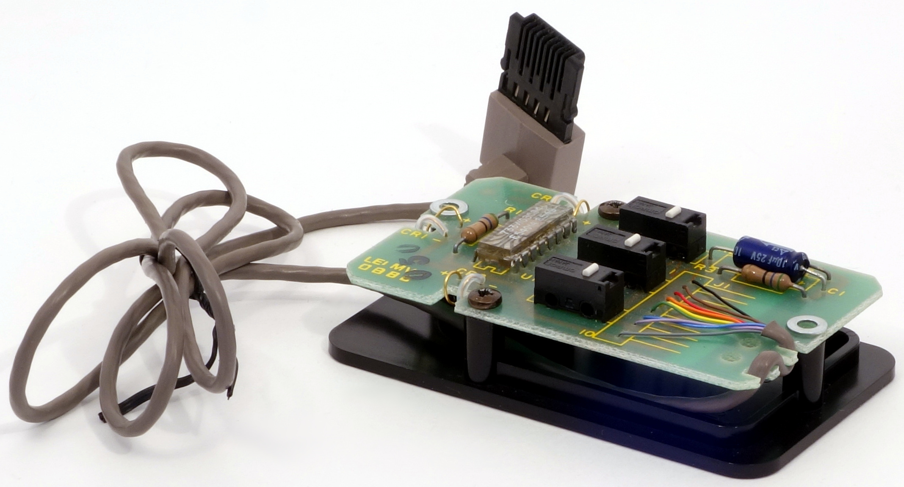
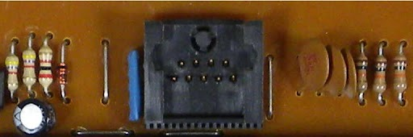

# USB Xerox Star mouse converter

This prject allows you to plug Xerox Star two- and three-button mice into USB and use them with any modern computer.

The converter is based on Arduino Pro Micro and uses a sophisticated 3D printed case.

## Mouse jack

Except early versions, these mice have a really esoteric jack:

The socket was mounted in the Xerox keyboard and looks like this:

We couldn't find any spare parts, and had to 3D print it as a part of the converter case.
 
The case consists of two parts, one inserted into another (as a drawer).

## Pinout

Xerox Mice are plain quadrature (parallel) cursor movers. It means that coordinates are encoded as Xa, Xb, Ya, Yb, also there are 2 or 3 lines for buttons, power, and ground.
Mouse uses colored wires. 

The pinout of the mouse was figured out experimentally tracking the wires and printed board.

|No.| color | No. | Connected to     | Meaning |
+---+-------+-----+------------------+---------+
| 1 | red   |  3  |     U1 ( 7 / 10) | YB      |
| 2 | brown |  2  |     U1 ( 8 /  9) | YA      |
| 3 | yellow|  5  |     U1 ( 5 / 12) | XB      |
| 4 | orange|  4  |     U1 ( 6 / 11) | XA      |
| 5 | gray  | 10  | +5V U1 ( 1 / 16) |VDD (+5V)|
| 6 | violet|  8  | GND U1 ( 9 /  8) | GND     |
| 7 | black |  1  | S1, U1 (12 /  5) | BD A    |
| 8 | blue  |  7  | S2, U1 (15 /  2) | RD B    |
| 9 | green |  6  | S3, U1 (14 /  3) | YD A    |
|   | NC    |  9  | GND              |         |

## Assembly

3D Print the case:

* ArdMouse4-Body.stl (main part)
* ArdMouse4-Body001.stl (cover)

You will need inserting pins into the holes of the *main part* to "assembly" jack.
For example, you can cut off pins from Arduino and use them.

See the [sketch](XeroxDuino.ino) for Arduino pins where to connect the wires (or use your own variant and modify the sketch).

BTW, the sketch is heavily based on the [AmigaInputToUSB](https://github.com/BleuLlama/AmigaInputToUSB) project. 

## Usage

Well. We [recreated mouse pad](Xerox_mousepad_A4.png) from scratch. You can print it on paper (Xerox did the same) and use.
